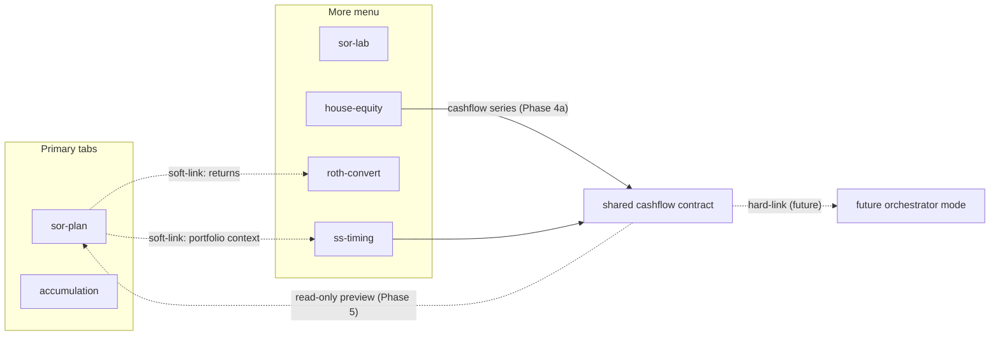

# Four-Feature Roadmap: Accumulation, SS, Roth, House Equity

This is the **source of truth** for the next multi-feature work after SOR Lab.
It is scaffolding, not permanent documentation — delete it after the last phase ships
(permanent conventions move into `.cursor/rules/` as they stabilize).

Working plan in the style of [`.cursor/plans/multi-feature.md`](multi-feature.md): each phase
is a fresh chat, tests green at every boundary, decisions appended to the status log at the
bottom. That log is the only context the next phase's chat gets besides the code.

## How to use this file

**This is a multi-session plan.** Do not attempt to execute it all at once.
Each phase (e.g., Phase 0a, Phase 1, Phase 2a) runs in its own fresh chat.

Kick off a phase with a prompt like:

> Read `.cursor/plans/four-feature-roadmap.md`, execute Phase 0a, and update the
> Status / decisions log at the bottom with what was done and any decisions made.

1. Start a new chat.
2. Use the prompt above with the phase you want.
3. When the phase is complete and tests pass, update the Status / decisions log in **this** file.
4. Close the chat and start a new one for the next phase.

Any Cursor UI plan copy outside the repo is a pointer only — edit and log progress here.

### Phase checklist (todos)

- [x] Phase 0a — Shell & Nav (More menu, primary vs more, accessibility, badge rollup)
- [x] Phase 0b — State Versioning (`stateVersion`, migrate hook, share-link size guard)
- [x] Phase 0c — Worker Dispatcher & Scaffold (thin dispatcher, asset decoupling, checklist)
- [x] Phase 1 — Accumulation (pilot)
- [x] Phase 2a — Social Security deterministic core
- [x] Phase 2b — Social Security Monte Carlo + policy shocks
- [ ] Phase 3 — Roth Convert
- [ ] Phase 4a — House Equity comparison
- [ ] Phase 4b — HECM calibration (gated)
- [ ] Phase 5 — Integration prep

## Locked decisions

| Topic | Decision |
|---|---|
| Shape | Four new features now; the hard-link orchestrator is future work, not built here |
| Order | Foundation → **Accumulation (pilot)** → SS (2a/2b) → Roth → House Equity (4a/4b) → Integration prep |
| Why pilot first | Accumulation is the smallest feature; it proves the Phase 0 scaffold before the two large ones |
| Couples | SS + Roth model couples in v1; Accumulation + House Equity are household-level single-input |
| Tone | Educational explorer, illustrative; match existing Plan help tone, no new disclaimer surface |
| Cross-feature now | Independent state models; soft-link Plan sessions only for Roth returns and optional SS portfolio context |
| Soft vs hard link | Soft links / dependency snapshots as Lab does today; assume a future orchestrator hard-links saved scenarios |
| Lab | Do not touch SOR Lab feature code; **shared** [`src/core/sensitivity.js`](../../src/core/sensitivity.js) is reused freely |
| Sessions / jobs | Full session chrome from day one; all heavy runs through [`src/state/jobs.js`](../../src/state/jobs.js) + workers |
| Nav | Plan + Accumulation are primary tabs; Lab and the other new features live under a **More** control |
| Money units | Real / today's dollars everywhere **except** House Equity, which computes nominal internally and displays real |
| Non-goals | No state tax detail; no IRMAA/Medicare engine; no regulatory HECM compliance claims; no SSA earnings-record import; no multi-user |
| Bundle | Single-file build stays; large tables (RMD factors, PLF) live in compact dedicated data modules |
| Assets | Six investable classes + inflation, shared only — no feature forks the return tables |

### Decisions from plan review

- **Roth tax model is a user-defined rate ladder**, not a bracket engine and not a single effective rate. The user enters tiers (taxable-income ceiling → rate); "fill my 22% band" means filling to their own tier ceiling. Ships **prefilled with an editable ladder approximating current federal brackets**, clearly labeled illustrative. This resolves the bracket-fill / effective-rate contradiction in the original framing.
- **Accumulation needs a new projector.** [`simulatePath`](../../src/core/simulation.js) has no contributions input at all and is tuned for withdrawal strategies, floors, and guardrails. Phase 1 adds `src/core/accumulation.js` rather than bending the withdrawal engine or abusing the negative-withdrawal-as-deposit quirk.
- **House Equity is nominal internally.** Mortgage rates, HELOC interest, and reverse-mortgage credit-line growth compound nominally, and "borrow now and invest" compares a nominal rate to real returns. Real-dollar display only at the presentation layer; inflation comes from the shared history data.
- **Phase 0 shrinks to what has consumers now.** The cross-feature cashflow schema moves to Phase 4a (its first producer); the Monte Carlo policy-shock helpers are born in Phase 2b and promoted to shared when Roth reuses them in Phase 3.
- **Per-feature state versioning is added in Phase 0** — it is the infrastructure gap that actually blocks all four features.
- **Feature renamed** `allocation` → `accumulation` (tab "Accumulation"), avoiding conceptual collision with [`src/core/allocation.js`](../../src/core/allocation.js) and describing what it does.
- **House Equity splits** into 4a (ships, includes a clearly-labeled simplified reverse mortgage) and 4b (calibrated HECM factors, gated on reference validation), so validation cannot block the whole phase.
- **Each feature ships inline help and three named presets** as part of its definition of done.

### Feature identities

| Id | Tab label (under More) | Owns |
|---|---|---|
| `accumulation` | Accumulation | Contributions, IRA/Roth/after-tax sleeves, one-time events, glidepath, risk/return region, weight tornado |
| `ss-timing` | Social Security | Couples claim strategies, PIA/earnings helper, end-age sensitivity, MC with policy shocks |
| `roth-convert` | Roth Convert | Rate-ladder fill + lifetime compare, Trad/Roth/taxable, RMD + QCD |
| `house-equity` | House Equity | Nominal equity-access comparison: simplified RM, private RM, HELOC, cash-out refi vs invest |



---

## Phase 0 — Shell, versioning, and scaffold

*To mitigate the risk of touching shared nav, persistence, and the worker at once, Phase 0 is split into three sub-phases. Each can be built and tested independently.*

### Phase 0a — Shell & Nav

**Nav: primary vs. More.** Extend [`src/state/features.js`](../../src/state/features.js) with a placement flag (`primary` | `more`) on `registerFeature`, and render from [`src/partials/shared/header.html`](../../src/partials/shared/header.html): Plan and Accumulation as top-level tabs; Lab and the rest inside a More control. Requirements:
- Keyboard and screen-reader accessible (button + listbox semantics, Escape closes, focus returns).
- Busy/progress badge **rolls up** onto the More control when a hidden feature has a running job, and shows per-item inside the menu.
- Active feature persists in `fs:app:prefs` as today; a share link targeting a More feature opens it correctly.
- Narrow-viewport behavior: the equal-width grid in [`src/styles.css`](../../src/styles.css) keeps two primary cells plus More rather than shrinking six cells.
- **Existing tests to update:** [`tests/features.test.js`](../../tests/features.test.js) (placement flag), [`tests/e2e/smoke.spec.js`](../../tests/e2e/smoke.spec.js) and [`tests/e2e/sorLab.spec.js`](../../tests/e2e/sorLab.spec.js) (tab bar assertions change when Lab stays primary but the bar gains a More control).

### Phase 0b — Per-Feature State Versioning

Today the envelope carries Plan's `SCHEMA_VERSION` and non-Plan state is passed through unmigrated:

```144:147:src/state/persistence.js
  const state =
    feature === FEATURE_SOR_PLAN
      ? migrateScenario(rawState, parsed.schemaVersion)
      : rawState;
```

- Add a per-feature `stateVersion` written into session payloads and the export envelope.
- Add an optional `migrate(state, fromVersion)` hook on the session adapter in [`src/ui/sessionChrome.js`](../../src/ui/sessionChrome.js). Plan keeps using `migrateScenario` through the same hook so there is one code path. Dependency snapshots carry their own feature's version.
- **Share-link size guard.** Add a payload-size check on Link generation with a clear "payload too large, use Export instead" message. Four more features embedding Plan snapshots makes the existing URL-length risk real.

### Phase 0c — Worker Dispatcher & Scaffold

- **Thin worker dispatcher.** Keep one worker bundle but stop growing a god-module: [`src/workers/simulation.worker.js`](../../src/workers/simulation.worker.js) becomes a dispatcher that routes by message `type` to pure compute modules in `src/core/`. Existing Plan/Lab message types (`run`, `chunk`, `goalSeek`, sensitivity) move behind that dispatch with no behavior change; each later feature registers its own handler pointing at its own `src/core/<domain>.js`. Domain math stays pure and Vitest-friendly, and no feature's code is imported by another feature.
- **Shared-asset decoupling.** Confirm [`src/data/historicalData.js`](../../src/data/historicalData.js), [`src/core/history.js`](../../src/core/history.js), and [`src/core/allocation.js`](../../src/core/allocation.js) are usable with zero Plan DOM coupling (Plan's UI wrapper [`src/features/sor-plan/history.js`](../../src/features/sor-plan/history.js) stays feature-owned). Document `ALLOCATION_ENGINE_KEYS` as the cross-feature asset contract in the architecture rule.
- **Feature scaffold checklist** (reused verbatim in Phases 1–4):
  - `src/features/<id>/` with `index.js`, `session.js`, `run.js`, `partials/`, `ui/`
  - `FEATURE_*` constant in [`src/state/storageKeys.js`](../../src/state/storageKeys.js)
  - Register in [`src/main.js`](../../src/main.js); `#feature-<id>` root in `index.html`; partial dir added to `partialDirectory` in [`vite.config.js`](../../vite.config.js)
  - Session adapter (`getState`, `applyState`, `stateVersion`, `migrate`, `getDependencies` when applicable)
  - Compute in `src/core/<domain>.js`, invoked via the worker dispatcher and [`jobs.js`](../../src/state/jobs.js)
  - Charts rendered or resized in `onActivate` (hidden roots size to zero)
  - Vitest for math; one thin Playwright smoke assertion
  - Inline help copy + three named presets

**Phase 0 Exit:** More menu works and is accessible; Plan/Lab behavior unchanged; versioning, dispatcher, and size guard tested; architecture rule updated for placement, versioning, dispatcher, and "no feature forks asset data."

---

## Phase 1 — Accumulation (`accumulation`) — scaffold pilot

Smallest feature, highest infrastructure reuse. Its job is to validate Phase 0 end to end.

**New shared engine:** `src/core/accumulation.js` — a pure projector for the accumulation problem: annual contributions per sleeve, growth from shared market sampling, one-time scheduled events, no ongoing withdrawal logic. Reuses `buildAllocationOverTimeSeries` from [`src/core/allocation.js`](../../src/core/allocation.js), the sampling modes and correlation machinery in [`src/core/history.js`](../../src/core/history.js), and [`src/core/rng.js`](../../src/core/rng.js) for CRN-pinned seeds. Explicitly does **not** modify [`src/core/simulation.js`](../../src/core/simulation.js).

**Scope:**
- Sleeves: IRA (pre-tax), Roth, after-tax. Contribution ceilings are plain user inputs, not an IRS rules engine. After-tax sleeve tracks basis and applies a single user drag rate for taxable growth.
- One-time events: signed scheduled amounts (house purchase as the motivating case), real dollars.
- No recurring retirement withdrawals — that is Plan's job.
- Views: (a) sample growth paths with percentile bands; (b) glidepath designer over waypoints; (c) **risk/return region** — a cloud of resampled frontiers rather than one crisp line, because a frontier estimated from historical means implies precision it does not have; (d) weight tornado using shared [`src/core/sensitivity.js`](../../src/core/sensitivity.js) with CRN.
- Compute budget: coarse weight grid over the six classes with a stated step size, chunked through [`src/workers/parallelPool.js`](../../src/workers/parallelPool.js). Document the grid resolution and run-count ceiling in the feature's help text so results are not read as an optimum.
- No write-back to Plan risk presets.

**Tests:** Vitest for contributions, sleeve accounting, event application, glide series, and frontier-region sampling; one smoke e2e (open More → Accumulation → run → charts non-zero).

---

## Phase 2a — Social Security core (`ss-timing`)

Deterministic and shippable on its own.

- Couples: independent claim ages per person, simplified educational spousal and survivor rules (not an SSA manual), per-person planning end ages.
- Benefit inputs: direct FRA/PIA monthly entry, plus an optional earnings-history helper (age → earnings grid → simplified bend-point PIA estimate). No SSA import.
- **End-age sensitivity strip** instead of mortality tables: every comparison runs at end ages 80 / 85 / 90 / 95 (user-editable) and shows where the claim-age ranking flips. Without this, a single typed end age silently determines the answer.
- Break-even summary derived from the fixed-age runs.
- Real dollars; benefits constant in purchasing power, matching Plan.
- Full session chrome; compute in `src/core/socialSecurity.js` via the dispatcher.

**Tests:** Vitest for PIA helper, claim-age curves, spousal/survivor simplifications, end-age strip; thin smoke e2e.

## Phase 2b — Social Security Monte Carlo

- Bridge-portfolio modeling for delayed claiming: spend a specified amount from a portfolio until claim, using the shared sampling core (reuse `src/core/accumulation.js` for the drawdown-free growth pieces; a focused bridge path, not a reimplementation of Plan withdrawal strategies).
- **New `src/core/policyShocks.js`**: effective tax-rate noise around a user base rate, and benefit-cut scenarios (discrete cut at a year, or phased). Seeded via `deriveSeed` so shocks are CRN-compatible with market draws. Written here with one consumer, promoted to a documented shared module when Roth reuses it in Phase 3.
- Outputs: claim-age comparison with portfolio depletion/success metrics under MC alongside the deterministic cashflow view.
- Optional soft-link to a saved Plan session for starting balance and return assumptions; self-contained inputs otherwise. Export embeds the Plan snapshot when linked, following the Lab dependency pattern.

**Tests:** Vitest for shock generators and bridge paths; e2e limited to tab-switch-mid-job on this feature.

---

## Phase 3 — Roth Convert (`roth-convert`)

- **Tax model: user-defined rate ladder.** Tiers of (taxable-income ceiling → marginal rate), prefilled with an editable ladder approximating current federal brackets and labeled illustrative. Both modes read from this one structure.
- Modes: (1) ladder-fill planner — convert up to a chosen tier ceiling each year; (2) lifetime convert-vs-don't comparison.
- Accounts: Traditional, Roth, and taxable (basis plus rough gain recognition at a user rate; no tax lots).
- RMD + QCD: Uniform Lifetime factors, spouse-as-sole-beneficiary factor for couples, QCD reducing taxable RMD. Factor tables in a compact dedicated data module.
- **Rate-premium input** to proxy the excluded drivers: IRMAA surcharges, Social Security benefit taxation, and the survivor filing-status effect. Help text states plainly that these are not modeled directly and that leaving the premium at zero biases results optimistic.
- Returns: soft-link a saved Plan session for expected return / allocation / `distMethod` context (Lab-style `scenarioRef`); constant real return input when unlinked.
- Rate shocks reuse `src/core/policyShocks.js` from Phase 2b; conversion math in `src/core/rothConversion.js`.

**Tests:** Vitest for ladder fill, RMD/QCD, conversion ladders across couples ages, taxable-sleeve basis; e2e smoke for both modes plus dependency import rename.

---

## Phase 4a — House Equity comparison (`house-equity`)

Framing: **leveraging house equity** — the goal is accessing equity as early as useful, not preserving residual home equity.

- **Nominal internal, real display.** Loan balances, credit-line growth, and payments compound nominally; charts and metrics convert to today's dollars using the shared inflation series. Assumption stated in help text.
- Strategies compared on one set of household inputs:
  - Simplified reverse mortgage (tenure and line-of-credit style draws), clearly labeled as a simplified educational model
  - Private reverse-mortgage style product, parameterized (rate, fees, proceeds percentage)
  - HELOC-style line with interest and draws
  - Cash-out refinance / traditional mortgage with proceeds invested, using shared market Monte Carlo
- Metrics favor early access: time-to-liquidity, cumulative real cash extracted, sustainability of draws, portfolio path when proceeds are invested. Residual equity is reported but is not the headline score.
- **First cashflow-series producer.** The versioned cross-feature series shape is defined here, with a real producer: yearly signed real-dollar amounts plus metadata (source feature, session name, units, version). Nothing consumes it until Phase 5.
- Compute in `src/core/houseEquity.js`; full sessions.

**Tests:** Vitest per strategy plus comparison fixtures and nominal-to-real conversion; thin smoke e2e.

## Phase 4b — HECM calibration (gated)

- Collect reference fixtures: published principal-limit-factor style tables and at least one known reference calculator's outputs.
- Golden-file Vitest matching the fixture set within a stated tolerance; these tests are merge blockers for this phase.
- Only after fixtures pass: enable a calibrated HECM preset in the UI and adjust its labeling from "simplified" to "calibrated against published factors."
- If fixtures cannot be sourced, 4a stands as shipped and this phase stays open — the product is not blocked.

---

## Phase 5 — Integration prep (not the orchestrator)

- Standardize the Phase 4a cashflow contract across producers: SS benefit streams, Accumulation one-time events, House Equity draws, Roth conversion tax flows.
- Extend each feature's `getDependencies` / export path to attach its cashflow series.
- Add a Plan-side **read-only preview** of an imported external cashflow series — rendered alongside Plan's own spending, with no effect on Plan math or `majorEvents`.
- Document the future orchestrator: selects one saved session per feature, hard-links them, and runs a combined household view. Explicitly out of scope to build here; the architecture rule records that hard-linking is reserved for it.
- README: one short non-technical bullet per shipped feature.

**Exit:** A House Equity or SS export carrying a cashflow series imports into Plan and previews without altering Plan spending logic.

---

## Cross-cutting rules

- [`.cursor/rules/multi-feature-architecture.mdc`](../rules/multi-feature-architecture.mdc): feature state under `fs:<id>:*`; no feature reaches into another feature's DOM or module state.
- Financial math heavily commented per [`financial-math-readability.mdc`](../rules/financial-math-readability.mdc); every new `src/core/` module states its units (real vs nominal) at the top.
- Verification per phase: `npm test`, targeted `npx playwright test <name>` plus the full suite, `npm run build`. Do not drive the app manually ([`testing-standards.mdc`](../rules/testing-standards.mdc)).
- E2E stays smoke-first: one thin assertion per new feature, option matrices in Vitest only.
- Definition of done for every feature phase includes inline help copy and three named presets.

## Risks

- **Phase 0 touches shared nav, persistence, and the worker at once.** This is mitigated by splitting Phase 0 into three sub-phases (0a, 0b, 0c) that can be built and tested independently.
- **Worker dispatcher refactor risks Plan/Lab regressions** — it moves existing message handling. Full Playwright suite is the gate, not just the new spec.
- **SS remains the largest feature** even split into 2a/2b; couples survivor rules are where simplification decisions will be contested. Record every simplification in the status log.
- **Roth prefilled ladder ages out** as tax law changes. Label it illustrative, keep the values in one data module, and never treat it as authoritative.
- **House Equity nominal/real boundary** is the most likely source of silent errors; unit-test the conversion at the boundary, not just end results.
- **HECM fixtures may never arrive**, which is why 4b is separate.
- **Bundle growth** from RMD and PLF tables plus four feature UIs; keep data modules compact and check `dist/index.html` size each phase.
- **Future orchestrator must not be half-built inside Plan.** Phase 5 stops at contracts and read-only preview.

## Status / decisions log

(Each phase's chat appends dated entries here: what shipped, and any decisions that affect later phases.)

- 2026-08-01 — Framing answers locked: four features, More overflow, couples on SS + Roth, full session chrome, all heavy runs on workers, non-goals (no state tax, no IRMAA engine, no HECM compliance, no SSA import, no multi-user), bundle approach 32C, Lab not extended.
- 2026-08-01 — Plan review folded in. Order changed to **Accumulation first as scaffold pilot**, then SS (2a/2b), Roth, House Equity (4a/4b), integration prep. Roth tax model resolved to a **user-defined rate ladder, prefilled and editable**. Feature renamed `allocation` → `accumulation`. New `src/core/accumulation.js` projector instead of extending `simulation.js` (no contributions support there). House Equity computes **nominal internally, displays real**. Phase 0 reduced to consumers-now work and gained **per-feature state versioning** and a **thin worker dispatcher**; cashflow schema deferred to Phase 4a, policy shocks to Phase 2b. Added SS end-age sensitivity strip, Roth rate-premium proxy for IRMAA / SS taxation, risk/return region instead of a crisp frontier, share-link size guard, More-menu accessibility and badge rollup, existing-test updates, and help + three presets as per-feature definition of done.
- 2026-08-01 — Phase 0 split into 0a (Nav), 0b (Versioning), and 0c (Worker Dispatcher) to isolate risk. Added explicit instruction that this is a multi-session plan (one chat session per phase).
- 2026-08-01 — Plan copied into the repo as `.cursor/plans/four-feature-roadmap.md` (source of truth for multi-chat handoff). Cursor global plan copy is a pointer only.
- 2026-08-01 — **Phase 0a shipped (Shell & Nav).**
  - `registerFeature` takes `placement: 'primary' | 'more'` (default `primary`).
  - Tab bar renders primary tabs + always-visible **More** control (button + listbox); Escape closes and returns focus; Left/Right on the tablist; ArrowDown opens More.
  - When a More feature is active, More’s label becomes that feature’s title and the control is selected.
  - Busy/progress badges roll up onto More; per-item badges remain in the menu.
  - **Nav decision (overrides earlier “Plan + Lab primary”):** primary = Plan + Accumulation; Lab moved under More. Accumulation registered as a thin primary stub (`src/features/accumulation/`) so the second primary slot is reserved; full Accumulation UI is still Phase 1.
  - Always show More even if empty (`1A`); More label switches to active feature title (`2B`); omitted placement defaults to primary (`3A`).
  - Updated: `features.js`, styles, architecture rule, `features.test.js`, smoke / sorLab / workers e2e.
- 2026-08-01 — **Phase 0b shipped (State Versioning).**
  - Canonical field is **`stateVersion`** on envelopes, IndexedDB session records, and dependency snapshots. No dual-read/write of `schemaVersion` on `fs-scenario` (clean break; legacy `sor-scenario` *file* import still uses its `schemaVersion` field).
  - All migrators + dispatch live in [`src/state/migrations.js`](../../src/state/migrations.js) (`migrateScenario` moved out of `scenario.js`; added `migrateLabState`, `registerFeatureMigrator`, `migrateFeatureState`). Plan/Lab register at module load; session adapters re-register `stateVersion` + `migrate`.
  - Lab deps stamp Plan’s `stateVersion` (`SCHEMA_VERSION`). Persistence/sessions call the registry only.
  - Share-link size guard: full URL ≤ **8000** chars; over → “Share link is too large. Use Export instead.” Export unrestricted.
  - Accumulation still has no session adapter (Phase 1).
  - Tests: `migrations.test.js`, updated `shareLink` / `sessions` / `scenario` migrate imports; architecture rule updated.
- 2026-08-01 — **Phase 0c shipped (Worker Dispatcher & Scaffold).**
  - Thin dispatcher: [`src/workers/simulation.worker.js`](../../src/workers/simulation.worker.js) routes via [`dispatch.js`](../../src/workers/dispatch.js) `HANDLERS` map to `src/workers/handlers/{connect,chunk,planRun,planGoalSeek,sensitivity}.js`. Plan/Lab message types and done payloads unchanged; feature `run.js` / `jobs.js` untouched.
  - **Unknown `type`** posts `{ type: 'error', message: 'Unknown worker message type: …' }` and does not open a pool (was silent fall-through).
  - Shared assets confirmed Plan-DOM-free (`historicalData.js`, `core/history.js`, `core/allocation.js`); Plan UI wrapper stays at `sor-plan/history.js`. No code forks needed.
  - Architecture rule: worker dispatcher, **no feature forks asset data**, `ALLOCATION_ENGINE_KEYS` / `LOGNORMAL_ORDER` contract, and new-feature scaffold checklist.
  - Out of scope (unchanged): `spawnSubWorkerPorts` still duplicated in Plan/Lab; Accumulation projector still Phase 1.
  - Tests: `workerDispatcher.test.js`; full Vitest + Playwright green; `npm run build` ok (`dist/index.html` ~2.57 MB).
- 2026-08-01 — **Phase 1 shipped (Accumulation pilot).**
  - New pure projector [`src/core/accumulation.js`](../../src/core/accumulation.js) (real $); does **not** extend `simulation.js`.
  - Feature scaffold under [`src/features/accumulation/`](../../src/features/accumulation/): session + migrator (`ACCUMULATION_STATE_VERSION = 1`), presets, own history wrapper, run/jobs, charts resized on `onActivate`.
  - **Returns UI (1A):** year range + `distMethod` + profiles via shared `core/history.js` (no Plan history import).
  - **Contribution tiers per sleeve** with **amount ($000s/yr) + growth %**; last tier fills the horizon.
  - **MC fuzzes market returns only.** Primary view: P10/P50/P90 uncertainty cone over `numYears`.
  - **Savings impact sweep:** Low / Med / High = **0.5× / 1.0× / 1.5×** contribution amounts (growth % unchanged, CRN shared).
  - Optional weight explore: coarse 20% grid (ceiling **48** mixes), risk/return cloud + weight tornado on median ending balance; toggleable for faster runs.
  - Worker `type: 'accumulation'` handler runs on the **master worker** (Plan `ParallelPool` chunk shape is withdrawal-oriented; multi-core Accumulation chunking deferred).
  - Three presets: Steady Saver, Aggressive Builder, Catch-Up. Full session chrome; no Plan soft-link / no risk-preset write-back.
  - Tests: `accumulation.test.js`, `tests/e2e/accumulation.spec.js`; full Vitest + Playwright green; `npm run build` ok (`dist/index.html` ~2.62 MB).
- 2026-08-01 — **Phase 2 shipped (merged 2a + 2b): Shared returns UI + Social Security full MC.**
  - **Shared returns/allocation UI:** [`src/state/returnsAllocationSlice.js`](../../src/state/returnsAllocationSlice.js) (canonical slice + `historical`→`resampling`) and [`src/ui/returnsAllocation/controller.js`](../../src/ui/returnsAllocation/controller.js). Accumulation mounts the controller; Plan keeps legacy DOM ids via thin wrapper in `sor-plan/history.js`. Architecture rule updated. `profilesToLogNormal` promoted to `core/history.js`.
  - **SS independent of Plan** — soft-link cancelled; self-contained bridge portfolio + shared returns UI only.
  - Feature `ss-timing` under More: session (`SS_TIMING_STATE_VERSION = 1`), three presets (Both Delay to 70 / Both Claim Early / Split), worker `type: 'ssTiming'`.
  - Deterministic core [`src/core/socialSecurity.js`](../../src/core/socialSecurity.js) (real $): own early/DRC factors, spousal `max(0, 0.5×otherPIA − ownPIA)` with simple early haircut, **survivor** = after one planning end age the living spouse gets `max(own package, deceased’s package at death)`; PIA helper with illustrative bend points; end-age strip 80/85/90/95; named strategies **and** 62–70 claim-age grid; break-even early vs 70.
  - MC: bridge OC via `simulateBridgePath` / `runBridgeMonteCarlo` in `accumulation.js`; [`src/core/policyShocks.js`](../../src/core/policyShocks.js) tax-rate noise + discrete/phased benefit cuts (CRN via `deriveSeed`); born here for Roth reuse later.
  - Views: strategy bar chart, strip + flips, claim grid, OC MC panel (shocked lifetime + bridge success/ending P10/P50/P90).
  - Tests: `returnsAllocationSlice.test.js`, `socialSecurity.test.js`, `tests/e2e/ssTiming.spec.js`; full Vitest + Playwright green; `npm run build` ok (`dist/index.html` ~2.67 MB).
