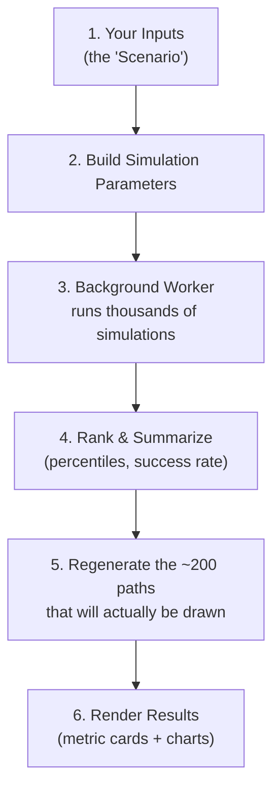

# 📈 Personal Finance Simulator

**[▶ Try the simulator](https://mattpeloquin.github.io/FinanceSimulator/dist/index.html)** — runs locally in your browser, no account required

Welcome to the Finance Simulator! This is a powerful, interactive tool that helps you visualize your financial future, plan for retirement, and understand the risks associated with the stock market.

## Why is this so easy to deploy?

This entire simulator is a **single, self-contained HTML file**.

- **No cloud, you control all data:** This app doesn't use databases, servers, or any cloud services.
- **Run anywhere:** Double-click the `index.html` file and run in your browser.
- **Designed for vibe coding:**  Follow instructions below if you want to change or extend.

---

## Setting Up Your Dev Environment

You don't need to be a software engineer to modify this app! You just need a few basic tools installed on your computer.

### Step 1: Install the basics

1. **Node.js**: Download and install the LTS version from [nodejs.org](https://nodejs.org/). This runs the background tools needed to build the project.
2. **Cursor**: Download and install [Cursor](https://cursor.sh/), an AI-powered code editor that will essentially write the code for you.

### Step 2: Get the project running

1. Open the **Cursor** app.
2. Go to `File > Open Folder` and select the folder containing this project.
3. Open the Terminal inside Cursor by clicking `Terminal > New Terminal` in the top menu (or pressing `Ctrl + ``).
4. In the terminal window, type:
  ```bash
   npm install
  ```
   *Press Enter. This downloads the necessary project files (it may take a minute).*
5. Once that finishes, type:
  ```bash
   npm run dev
  ```
   *Press Enter. This starts up your local preview. You'll see a web link (usually* `http://localhost:5173`*). Click it or copy it into your browser (or Ctrl-Click the link in the terminal) to see the app running live!*
   *The first* `npm install` *also downloads the Chromium browser used for automated UI tests (about 150 MB). If you skip that step or tests complain about a missing browser, run* `npm run setup:e2e` *once.*

### Running automated tests (optional)

- **Unit tests:** `npm test`
- **Browser tests:** `npm run test:e2e` (Chromium is installed automatically during `npm install`; re-run `npm run setup:e2e` if needed)

To skip the browser download during install (e.g. in CI jobs that don't run E2E tests), set `SKIP_PLAYWRIGHT=1` before `npm install`.

---

## Extending the Code

You do not need to know how to code to add new features to this app. Instead, you can use **Vibe Coding**—where you use natural language to tell an AI what you want, and the AI handles the complex syntax and logic.

### Changing the app's colors

To tweak the look of the app (backgrounds, text, accent buttons, chart colors, and more), edit `themeTokens` at the top of `src/ui/theme.js`. Those values flow automatically into the page, charts, and dark mode — no need to hunt through dozens of files.

Your browser also remembers which settings panels you left open or closed on this device. That preference is separate from your saved simulation numbers, so resetting or importing a scenario won't change which sections are expanded.

### Changing the default starting values

To change what the simulator loads with on a fresh visit (year range, Find Best Plan default, and more), edit `BASE_DEFAULTS` in `src/state/defaults.js`. Each field has inline comments explaining valid options and limits. **Starting Portfolio** is blank on first load — enter a positive balance before running. If you already have an autosaved session in your browser, clear it or use a private window to see your new defaults on first load.

Values controlled by the **Easy Mode** slider (return method, Find Best Plan search settings, asset mix, market triggers and the no-cut balance threshold, balance Floor/Ceiling thresholds, glide spend timing, minimum withdrawal and consecutive-min recovery, gifting, spending timeline, and — when Find Best Plan is off — the full spending plan including cut/boost rates) live in `src/state/presets/balanced.json` and the other preset files. See the next section.

### Tuning the Risk Level presets

**Easy Mode** under Starting Portfolio gives first-time users a simple path: enter a horizon and portfolio size, pick a level from Conservative to Aggressive, and run. Each level is a JSON file in `src/state/presets/` (see the README there). With **Find Best Plan** enabled (the default), click the **Find Best Plan** button to search for the best spending plan for that level's success target. Turn Find Best Plan off to use the preset's built-in spending plan instead and click **Run Simulation** — Easy Mode stays on either way.

While **Use easy mode** is checked, changing the starting balance or horizon live-rescales derived values. Manually editing a preset-controlled setting switches Easy Mode off and keeps your values — re-check the box to reload the level. Tiers you add beyond the first are yours; the slider only manages the first tier of each list. With a **Specific List**, Easy Mode still sets allocations, search targets, gifting, guardrails, market adjustments, and percentage minimum floors — it does not fill or change your pasted year-by-year amounts.

### How to Vibe Code with Cursor

Cursor has a built-in AI assistant. You essentially act as the "Product Manager," and Cursor acts as your "Programmer."

1. **Use the Composer (Ctrl+I / Cmd+I)**
  - Press `Ctrl + I` (or `Cmd + I` on Mac) to open the AI Composer.
  - Simply type what you want to achieve in plain English.
  - *Example:* "Make the background of the app dark mode," or "Add a new text input for 'Annual Inflation Rate' next to the starting balance."
  - The AI will generate the code across multiple files. Simply click **Accept All** to apply it.
2. **Use the Chat Panel (Ctrl+L / Cmd+L)**
  - If you want to ask questions or figure out how something works, open the Chat panel.
  - *Example:* "How do the charts in this project work? I want to change the line color from red to blue."
  - The AI will read your files and give you the exact steps or code snippets you need.
3. **Handling Errors? Just ask the AI!**
  - If you add a feature and the screen goes blank, don't panic! 
  - Just copy whatever error you see in the terminal or on the screen, paste it into the Cursor chat, and say: "I got this error, please fix it." The AI will figure out what went wrong and fix it.
4. **Trust the Tests**
  - This project has automated tests to make sure things don't break. If you add a new feature, you can tell Cursor: "I just added an inflation input. Run the tests and fix any issues caused by my changes."

### Building Your Final Version

Once you've vibe-coded your app to perfection and want to share it with the world, open the terminal and type:

```bash
npm run build
```

This will bundle your entire app into a single `index.html` file located in the `dist` folder. You can now send that file to anyone or drag-and-drop it onto a web host! Happy building!

---

## How the Simulator Works (Logical Design & Flow)

This section explains what actually happens "under the hood" when you press **Run Simulation** — from your inputs, through the math, to the charts on screen. It's useful background reading if you want to vibe-code changes to the engine or the visuals.

### The big picture




### Step 1: Your inputs become a "Scenario"

Everything you type into the form — starting balance, yearly withdrawal, asset mix, year range, dynamic adjustment rules — is collected into one flat object called a **scenario** (`src/state/scenario.js`). This single object is the source of truth for the whole app:

- It is **autosaved** to your browser's local storage as you type, so refreshing the page never loses your work.
- It can be saved as a **named session** (stored in your browser via IndexedDB), or **exported/imported** as a JSON file to share with others. Use **New** to start a fresh scenario (your current named session is saved automatically first). **Save** updates the current session (name and optional description). **Reset** discards unsaved edits and restores the selected session to its last Save. **Copy** duplicates your current values under a new name without changing the original. The description appears below the session controls when set.
- Money fields are entered in thousands of dollars ($000s) and converted to real dollars just before the math runs.

The **historical data** (`src/data/historicalData.js`) is a built-in table of yearly returns from 1900 onward for six asset classes (US large growth, US large value, US small/mid, international, bonds, cash) plus inflation. When you change the year range, the app instantly recomputes the average return and volatility "profiles" for that window, redraws the mini history charts, and refreshes the pool of years available for resampling (`src/core/history.js`). If you've typed your own numbers into the profile fields, the app keeps them and shows an "Overwrite from history" link instead of replacing your edits.

> **A note on the data:** the built-in numbers are good-faith approximations assembled for illustration — the early decades especially are rounded reconstructions, since precise style-level index data doesn't exist that far back. They're great for exploring risk, but don't treat any single year as an exact historical fact.

### Step 2: Turning the scenario into engine-ready parameters

When you click **Run Simulation**, the scenario is validated (allocation must total 100%, year range must be valid, etc.) and converted into a `params` object the math engine understands: percentages become decimals, $000s become dollars, and the pool of historical years for your chosen range is attached. If you left the random seed blank, a random one is picked — but entering the same seed twice will reproduce the exact same results.

### Step 3: The simulation engine (runs off-screen in a Web Worker)

The heavy math runs inside a **Web Worker** (`src/workers/simulation.worker.js`) — a background thread — so the page never freezes, and a progress bar updates as it goes. The progress bar also shows how many CPU cores are being used. Changed your mind mid-run? A **Cancel** button under the progress bar stops the simulation instantly.

On multi-core machines, the worker can split each Monte Carlo run across several cores at once (Find Best Plan benefits too, since it runs many smaller simulations while searching). Open **Advanced simulation settings** and use **Core Usage** to choose **Low** (1 core), **Medium** (3 cores: 1 master + 2 sub-workers), or **High** (up to 8 cores: 1 master + 7 sub-workers). Lower settings leave more of your computer free for other apps; higher settings finish faster.

**Uncertain end date:** next to **Years to simulate (endpoint)**, you can optionally enter **+ years** and **− years** to model a retirement horizon that might run shorter or longer. Each simulation picks its own timeline inside that range (treated as very likely bounds). Leave both at **0** for a fixed horizon.

The same panel has **Withdrawal Success Metric** — choose **Auto** (recommended: total withdrawal for a fixed horizon, median per year when a range is set), or force **total lifetime withdrawal** or **median withdrawal per year**. Results show both metrics; the one you pick drives ranking, on-plan scoring, and the 3D chart coloring. **Plan Risk Tolerance** sets how far below plan a run can fall and still count as "on plan" in the results and 3D chart (Find Best Plan uses its own **Risk Tolerance** when enabled).

The core engine (`src/core/simulation.js`) simulates one "possible future" at a time. For each simulated year it:

1. **Picks the market's returns and inflation** using one of three methods you choose:
  - **Historical resampling:** grabs real years from your chosen range in consecutive runs that average the length you set on the slider, wrapping from the last year back to the first so every year in the range is used equally. That keeps crash-then-recovery patterns from actual history without rigid block boundaries.
  - **Smoothed historical:** uses the same real year-to-year sequences as resampling (same streaks, correlations, and crash patterns), but rescales each asset to the mean and volatility you set in the Return Assumptions panel, and adds a touch of smoothing so results aren't limited to only the exact historical years in your range. Good when you want history's shape with different forward-looking assumptions.
  - **Log-normal model:** draws statistically generated returns based on the mean/volatility profiles, using the historical **correlation between asset classes** (so stocks and bonds still move together the way they did in real life) and year-to-year smoothing controlled by the same block/smoothing slider (expected persistence, not a fixed block length).
2. **Grows the portfolio** by that year's inflation-adjusted (real) return, weighted by your asset allocation (optionally gliding toward later target mixes under **Adjust allocation over time** — a stacked chart shows the path).
3. **Figures out this year's withdrawal**, starting from your base plan (or a pasted year-by-year list), then applying staged **Spending Over Time** tiers (each tier sets an annual real change % that compounds continuously and an optional extra withdrawal for a set number of years), optional **Major Events** (one-time or recurring inflows like a house sale or inheritance, or known large payments — positive adds to the portfolio, negative is extra spending on top of that year's plan; marked as dots on the schedule chart), dynamic adjustments based on **real** market performance (with an optional "no cut" balance threshold — a bad market year never cuts spending while the balance is still above it — and an optional **max boost drawdown** that limits high-market spending boosts so the balance after that year's spending, except glide, doesn't fall more than that percent below the year's starting balance; a live mini chart next to those inputs shows the market-return curve you've configured), and a smooth balance-based spending scale (spending gradually ramps down as the balance falls below your floor, and ramps up without limit as it grows past your ceiling — another mini chart shows that curve). If you're using the Base + Spending Over Time strategy, optional staged minimum-withdrawal tiers limit how far guardrails can cut any single year — the schedule chart shows your plan and the minimum as separate lines. With a **Specific List**, percentage minimum tiers work the same way (each year's floor is a % of what you typed). Your typed amounts are the plan; the minimum is only a backstop in bad markets. Optionally set **Max consecutive minimums** and **Then stay on plan for** to return spending to the full plan for a stretch after too many years at the minimum. Negative list values are deposits and are never overridden by a minimum. **Gifting** (available under both strategies) lets you stage extra gift withdrawals over time — each tier sets a gift amount and a portfolio balance threshold. Set Gift to 0 on early tiers to defer gifting to later years. A gift is added only in years when your balance after the regular withdrawal or deposit still exceeds that threshold *and* that year's spending fully met your plan (including any glide-path surplus, so a temporary market cut that glide replaces does not block the gift). The schedule chart shows a thin dotted gift ceiling above your planned withdrawal. **Glide-path spend-down** (in the Dynamic Adjustments & Guardrails section, available under both strategies and gated by that section's Enable toggle) actively spends surplus down toward a target ending balance instead of letting good markets pile it up. Set a **Target** (blank = off; 0 means "spend to zero"), a **Spend Rate**, and a **Spend Timing** slider. Each year the simulator computes the balance still needed to fund your remaining plan and land on the target at the horizon; after any eligible gift is paid, when the portfolio still sits above that glide path, the spend-rate share of the remaining surplus is withdrawn on top of the plan. Because the glide path declines toward the target as the horizon shrinks, the extra spending concentrates in the later years of comfortable paths — and never cuts below your plan in lean ones. Slide Spend Timing toward **later** to hold surplus back for late retirement: it raises the glide path so the early years stay invested, which lifts both lifetime spending and success odds and helps plans that would otherwise dip to their minimum withdrawals mid-retirement; **sooner** recycles surplus as it appears.
4. **Subtracts the withdrawal** and records whether the portfolio ran out of money (the "depletion year").

This is repeated for every year in your horizon, and the whole thing is repeated for every simulation (10,000 by default).

**A clever memory trick:** the engine uses a *seeded* random number generator (`src/core/rng.js`), where each simulation gets its own predictable seed. That means the engine only needs to keep four summary numbers per simulation (final balance, total withdrawn, average return, depletion year) — it can throw away the year-by-year details and **perfectly regenerate any individual path later** just by re-running it with the same seed. That's how 10,000 simulations stay fast and memory-light.

### Step 4: Ranking and summarizing the outcomes

Once all simulations finish, the worker (`src/core/statistics.js`) computes:

- **Success Rate (not depleted)** — the share of futures where your portfolio never ran out of money.
- **Success Rate (on plan)** — a separate metric shown next to it: the share of futures whose withdrawals reached at least your acceptable shortfall below the planned schedule (default: within 5%; adjustable under **Advanced simulation settings** → **Plan Risk Tolerance**). When **Withdrawal Success Metric** is set to median per year, this compares each run's median yearly withdrawal to the planned median instead of lifetime totals.
- **Median end balance** and either **median total withdrawn** or **median withdrawal per year** across all runs (depending on the metric you chose), with the other metric shown underneath.
- A **ranking of every simulation** by your chosen withdrawal metric, used to identify the 10th through 60th percentile outcomes ("cautionary" through "above average"). Each percentile card is actually a *smoothed average of a small band of neighboring runs* (controlled by the smoothing input), so results don't jump around noisily between runs.
- A **histogram** of average annual real returns across all simulations, with summary cards above it (mean, median, worst, best, and spread) and colored reference bars for the median, P5, P95, and mean ± one standard deviation. A second histogram below it shows the same stats for every individual year real return used in the simulation.

### Step 5: Visualizing the results

Only the paths that will actually appear on screen are regenerated in full year-by-year detail (using the seed trick above):

- The **7 percentile paths** (5th–65th) for the timeline charts.
- About **200 paths sampled evenly between the 5th and 65th percentile** for the 3D chart (default view). On the chart itself you can switch column height between **Balance** and **Withdrawal**, stretch early years, and widen or narrow the percentile window (Show from / to, up to P90) — the page resamples those ~200 paths from the ranked runs without re-running the whole simulation.

The **Withdrawal Heatmap** is the exception: it is built from *every* simulation run. The engine keeps each run's per-year withdrawals, and the worker compresses them into a compact grid — one column per run (or a narrow band of neighboring runs), ranked by lifetime withdrawal from P5 up to an adjustable upper percentile (P60–P90), one row per year. Cell color is a continuous diverging spectrum (burnt orange → blue-gray → teal). By default it compares each year to **your plan** (orange = cut, teal = boost). You can switch to **vs Median** to compare against that year's median across the runs shown, or **Amount** to show absolute withdrawal dollars over the from/to window (orange = low, teal = high). Years with a true **$0 withdrawal** (the plan ran out) light up bright red so depletion stands out from ordinary cuts. When columns are averaged bands, a **Run** slider scrubs individual-run snapshots and a **Speed** slider replays random runs per column (a "hypothetical outcome plot") so the real run-to-run spread is visible instead of a smoothed mean; an **Early years** slider stretches the first rows for emphasis.

When you open an individual simulation (click a dot on the sequence-risk scatter chart, a column on the withdrawal heatmap, or pin a column on the 3D chart), hover a year on its withdrawal chart to see how that year's spending differed from your plan — adjustments, floor lifts, gifts, balance caps, and other levers are listed in the tooltip.

The worker then sends this compact, chart-ready package back to the page for display in cards and charts  (`src/ui/results.js` and `src/ui/charts/`).

### Find Best Plan: let the simulator find your plan for you

Instead of guessing at a withdrawal amount and checking whether it works, **Find Best Plan** flips the process around: tell it what you want (a target amount left over at the end, how confident you want to be, and how much belt-tightening you're willing to accept), and it searches for the highest sustainable spending plan that gets you there.

To use it:

1. Turn on the **Find Best Plan** switch (below Sequence of Returns, above Investment Planning).
2. Enter a **Target Ending Balance** (how much you'd like left over, on top of never running out), a **Desired Success %** (how sure you want to be that the plan works), and a **Risk Tolerance** (how much of your planned lifetime spending you're willing to give up in bad markets — 0% means stay on plan; higher values allow a bigger headline plan with more guardrail belt-tightening when markets are rough. The first 0–20% also opens how deep market/balance adjustments and glide surplus can go — full search depth at 20% and above — and discounts the Target Ending Balance so that legacy slack can fund spending).
3. Under **Base Annual Withdrawal**, leave **Include in search** checked (default) to let Find Best Plan find the best base amount, or uncheck it to keep your typed base fixed and search only the other levers — you'll need at least one other "Include in search" lever checked. If the goal isn't reachable at your fixed base, the simulator still shows the closest plan it found, with a warning at the top of the results.
  - Using the **Specific List** strategy instead? Find Best Plan always keeps every year's typed amount exactly as you entered it and searches only the **Market adjustment** and **Balance adjustment** levers below — check at least one of those.
4. Optionally, check **Include in search** on any other settings you'd like Find Best Plan to tune:
  - **Spending Over Time** — the first tier's extra withdrawal (annual change % and years stay as you typed). When this is checked, Find Best Plan switches its goal: instead of maximizing your lifetime total, it maximizes how much you can spend **per year during the first tier's years**, so it favors more aggressive front-loading.
  - **Market adjustment** — the Low and High market-triggered spending adjustments *and* the "no cut if balance above" threshold. The **Expected** adjustment is never searched: at the expected return the plan is on plan, so it stays at whatever you typed (normally 0). Low and High never stay at $0 — Find Best Plan always applies at least a small cut in weak markets and a small boost in strong ones. How deep those Low/High adjustments can go scales with Risk Tolerance over the first 0–20%.
  - **Balance adjustment** — Max Cut and Boost Rate only. Floor and Ceiling Balance stay as Easy Mode (or you) set them; Find Best Plan does not change those dollar thresholds. Cut/boost never stay at 0% when their matching threshold is on. How deep cut/boost can go scales with Risk Tolerance over the first 0–20% (full depth at 20%+).
  - **Glide-path spend-down** — the surplus **Spend Rate**. Find Best Plan first solves the plan with glide turned off, then searches for a spend rate that recycles surplus into more lifetime spending while your success goal still holds (your **Spend Timing** setting is respected). It sets the glide **Target** to the Risk-Tolerance-discounted Target Ending Balance so legacy slack is spendable. Glide spending itself always stops at that discounted target — and Find Best Plan counts runs that finish at or above it as successes (with or without the glide lever).
5. Click **Find Best Plan** (the Run button relabels itself while the mode is on). The simulator will try many combinations behind the scenes and, when it finishes, fill in the winning numbers directly into your inputs and show the full results for that plan.

**All withdrawal amounts are in today's dollars and include taxes:** the base annual withdrawal and every other spending field represent constant purchasing power — the simulator works in real returns and today's dollars everywhere (including reported market returns), so you don't need to build inflation into your numbers. Those withdrawal values also assume capital gains and income taxes come out of the withdrawal, so the net amount you can spend is lower. Other income such as a pension or Social Security is not modeled.

**Minimum withdrawals limit cuts, not the plan:** under the Base + Spending Over Time strategy, staged minimum-withdrawal tiers sit below your spending schedule and stop guardrails from cutting any single year too far — the chart shows plan and minimum separately. Find Best Plan's risk tolerance governs how far below the *full planned schedule* lifetime spending is allowed to fall in bad markets, how deep market/balance/glide levers may search over the first 0–20%, and how much of the Target Ending Balance can be spent as legacy slack. Optionally, **Max consecutive minimums** and **Then stay on plan for** return you to the full plan for a stretch after too many years at the minimum. With a **Specific List**, percentage minimum tiers work the same way — Find Best Plan keeps your list fixed and only tunes the Market and Balance adjustment levers, but any percentage minimums you set still apply during the search.

If your target is impossible to reach (e.g. the ending balance is unrealistically high for your starting balance and horizon), the simulator still shows the closest plan it found, with a warning at the top of the results — try lowering the target or the desired success percentage.

Turn the switch back off any time to return to typing in your own numbers and running a normal simulation — the values Find Best Plan found stay right where you'd expect.

**Heads up on run time:** checking any of the "Include in search" boxes makes Find Best Plan try substantially more combinations than a plain search (each candidate setting is tested by temporarily re-solving your withdrawal amount around it, so it can see the true payoff of a guardrail or a bonus before deciding whether it's worth it). Expect a full search with everything checked to take noticeably longer than Run Simulation — the progress bar will keep you posted.

**Tuning search speed vs. accuracy:** open **Advanced simulation settings** at the bottom of the form and scroll to **Find Best Plan: Simulations per Search Step** — how many simulations Find Best Plan runs to score each candidate plan while it's searching. Lower it for a much faster search (useful while you're experimenting with the targets), or raise it if you want the search itself to be more precise. Either way, the final plan Find Best Plan lands on is always double-checked using your full **Number of Simulations**, so the result you see is never less accurate than a normal run.

### Where to look when vibe-coding


| You want to change…                 | Look in…                                                                                            |
| ----------------------------------- | --------------------------------------------------------------------------------------------------- |
| The math of growth/withdrawals      | `src/core/simulation.js`, `src/core/withdrawal.js`                                                  |
| Find Best Plan's search logic       | `src/core/goalSeek.js`                                                                              |
| The historical dataset              | `src/data/historicalData.js`                                                                        |
| An input field or its default value | `src/state/scenario.js` (the `FIELDS` list) and the matching form partial in `src/partials/inputs/` |
| The Risk Level slider presets       | `src/state/presets/` (one JSON per level) and `src/ui/riskPreset.js` (slider behavior)              |
| A chart's look or behavior          | `src/ui/charts/` (one file per chart)                                                               |
| The summary numbers shown           | `src/workers/simulation.worker.js` and `src/core/statistics.js`                                     |
| Saving/loading sessions             | `src/state/persistence.js`                                                                          |


## License

This project is free to use, share, and modify under the [MIT License](LICENSE).