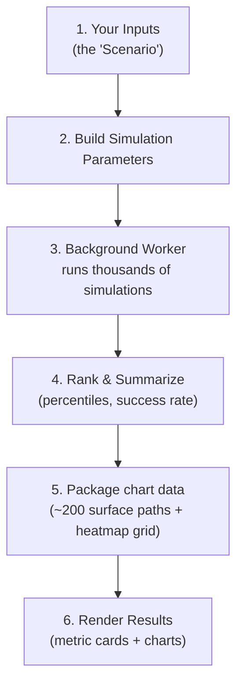

# 📈 Personal Finance Simulator

Welcome to the Personal Finance Simulator! This is a powerful, interactive tool that helps you visualize your financial future, plan for retirement, and understand the risks associated with the stock market. 

**[▶ Try the simulator](https://mattpeloquin.github.io/FinanceSimulator/dist/index.html)** — runs locally in your browser, no account required. Easy Mode and built-in help will get you started; this README is primarily for extending the simulator with AI coding.

## Why is this so easy to use?

This entire simulator is a **single, self-contained HTML file**.

- **No cloud - you control all data:** This app doesn't use databases, networks, or any servers.
- **No user accounts:** Your saved sessions are stored on your device; copies can be shared with links.
- **Run anywhere:** Double-click the `index.html` file and run in your browser.
- **Designed for vibe coding:**  Follow instructions below if you want to change or extend.

---

## Extending the Code

You do not need to know how to code to add new features to this app. Instead, you can use **Vibe Coding**—where you use natural language to tell an AI what you want, and the AI handles the complex syntax and logic.

### How to Vibe Code with Cursor

Cursor has a built-in AI assistant. You essentially act as the "Product Manager," and Cursor acts as your "Programmer."

1. **Use the Composer (Ctrl+I / Cmd+I)**
  - Press `Ctrl + I` (or `Cmd + I` on Mac) to open the AI Composer.
  - Simply type what you want to achieve in plain English.
  - *Example:* "Make the background of the app dark mode," or "Add a new text input for 'Annual Inflation Rate' next to the starting balance."
  - The AI will generate the code across multiple files. Simply click **Accept All** to apply it.
2. **Use the Chat Panel (Ctrl+L / Cmd+L)**
  - If you want to ask questions or figure out how something works, open the Chat panel.
  - *Example:* "How do the charts in this project work? I want to change the line color from red to blue."
  - The AI will read your files and give you the exact steps or code snippets you need.
3. **Handling Errors? Just ask the AI!**
  - If you add a feature and the screen goes blank, don't panic! 
  - Just copy whatever error you see in the terminal or on the screen, paste it into the Cursor chat, and say: "I got this error, please fix it." The AI will figure out what went wrong and fix it.
4. **Trust the Tests**
  - This project has automated tests to make sure things don't break. If you add a new feature, you can tell Cursor: "I just added an inflation input. Run the tests and fix any issues caused by my changes."

## Setting Up Your Dev Environment

You don't need to be a software engineer to modify this app! You just need a few basic tools installed on your computer.

### Step 1: Install the basics

1. **Node.js**: Download and install the LTS version from [nodejs.org](https://nodejs.org/). This runs the background tools needed to build the project.
2. **Cursor**: Download and install [Cursor](https://cursor.sh/), an AI-powered code editor that will essentially write the code for you.

### Step 2: Get the project running

1. Open the **Cursor** app.
2. Go to `File > Open Folder` and select the folder containing this project.
3. Open the Terminal inside Cursor by clicking `Terminal > New Terminal` in the top menu (or pressing `Ctrl + ``).
4. In the terminal window, type:
  ```bash
   npm install
  ```
   *Press Enter. This downloads the necessary project files (it may take a minute).*
5. Once that finishes, type:
  ```bash
   npm run dev
  ```
   *Press Enter. This starts up your local preview. You'll see a web link (usually* `http://localhost:5173`*). Click it or copy it into your browser (or Ctrl-Click the link in the terminal) to see the app running live!*  *The first* `npm install` *also downloads the Chromium browser used for automated UI tests (about 150 MB). If you skip that step or tests complain about a missing browser, run* `npm run setup:e2e` *once.*

### Building Your Final Version

Once you've vibe-coded your app to perfection and want to share it with the world, open the terminal and type:

```bash
npm run build
```

This will bundle your entire app into a single `index.html` file located in the `dist` folder. You can now send that file to anyone or drag-and-drop it onto a web host! Happy building!

---

## How the Simulator Works

This is a short map of what happens when you press **Run Simulation** — useful if you want to vibe-code changes to the engine or charts. Day-to-day controls and field help live in the app itself.

### The big picture



### From inputs to results

- **Scenario** — Everything you type into the form is collected into one object (`src/state/scenario.js`). It autosaves to your browser’s local storage as you type; named sessions are also stored in the browser. Money fields are entered in thousands of dollars ($000s) and converted to real dollars just before the math runs.
- **History** — Built-in yearly returns from 1900 onward for six asset classes (US large growth, US large value, US small/mid, international, bonds, cash) plus inflation (`src/data/historicalData.js`). Changing the year range updates average-return / volatility profiles and the pool of years available for resampling (`src/core/history.js`).

> **A note on the data:** the built-in numbers are good-faith approximations assembled for illustration — the early decades especially are rounded reconstructions, since precise style-level index data doesn’t exist that far back. They’re great for exploring risk, but don’t treat any single year as an exact historical fact.

- **Run** — On **Run Simulation**, the scenario is validated and turned into engine parameters. The heavy math runs in a background worker (`src/workers/simulation.worker.js` / `src/core/simulation.js`) so the page stays responsive. Each simulated year: sample markets (historical resampling, smoothed historical, or log-normal), grow the portfolio by the inflation-adjusted return for your allocation, apply your spending rules, and record the outcome. An optional random seed makes runs reproducible. Each run keeps summary stats plus compact per-year return and withdrawal data for charts; full year-by-year path detail for individual futures can be regenerated later from the same seed (`src/core/rng.js`).
- **Summarize** — Outcomes are ranked and summarized (`src/core/statistics.js`, `src/core/resultPackaging.js`): success rates (never depleted / on plan), medians, a classic flat 4% rule comparison, and percentile cards (roughly the 10th–60th, with nearby paths smoothed together).
- **Charts** — Results land in metric cards and charts (`src/ui/results.js`, `src/ui/charts/`): timelines for percentile paths (5th–65th), a 3D surface of about 200 paths (adjustable Show from/to window, default P5–P65; double-click a column to drill into nearby runs), a withdrawal heatmap built from every run (full P0–P100 source; same Show from/to window), and a sequence-risk scatter. Chart controls and color modes are documented in the app.
- **Find Best Plan** — Instead of guessing a withdrawal amount, this mode searches for the highest sustainable headline spending plan given a target ending balance, desired success %, and risk tolerance (`src/core/goalSeek.js`). When it finishes, it fills the winning numbers into your inputs and shows a full confirmation run. Details and search options are in the app.

**Assumptions:** All withdrawal amounts are in today’s dollars (constant purchasing power). The simulator works in real returns everywhere, so you don’t need to build inflation into your numbers. Withdrawals are assumed to cover capital gains and income taxes (net spendable income is lower). Other income such as a pension or Social Security is not modeled.

### Where to look when vibe-coding

| You want to change…                 | Look in…                                                                                            |
| ----------------------------------- | --------------------------------------------------------------------------------------------------- |
| The math of growth/withdrawals      | `src/core/simulation.js`, `src/core/withdrawal.js`                                                  |
| Find Best Plan's search logic       | `src/core/goalSeek.js`                                                                              |
| The historical dataset              | `src/data/historicalData.js`                                                                        |
| An input field or its default value | `src/state/scenario.js` (the `FIELDS` list) and the matching form partial in `src/partials/inputs/` |
| The Risk Level slider presets       | `src/state/presets/` (one JSON per level) and `src/ui/riskPreset.js` (slider behavior)              |
| A chart's look or behavior          | `src/ui/charts/` (one file per chart)                                                               |
| 3D drilldown / Show from–to window  | `src/core/surfaceDrilldown.js`, `src/ui/charts/outcomeWindow.js`                                    |
| The summary numbers shown           | `src/workers/simulation.worker.js` and `src/core/statistics.js`                                     |
| Saving/loading sessions             | `src/state/persistence.js`                                                                          |

## License

This project is free to use, share, and modify under the [MIT License](LICENSE).